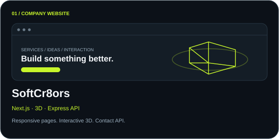
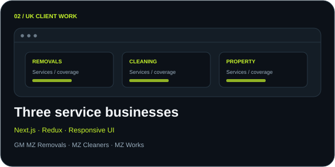
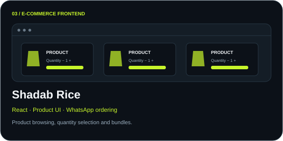
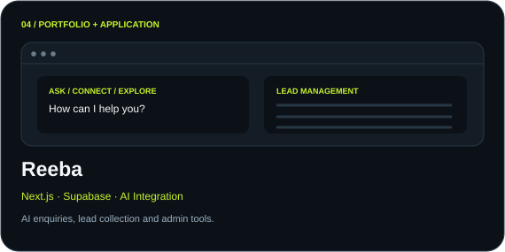
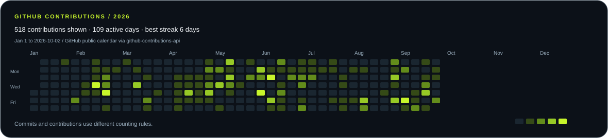

<picture>
  <source media="(prefers-color-scheme: dark)" srcset="./dark.svg">
  <source media="(prefers-color-scheme: light)" srcset="./light.svg">
  
</picture>

  
  
  

## I build interfaces that look good and work well.

I'm **Usama Faheem**, a frontend-focused MERN stack developer from Lahore, Pakistan. I build responsive websites, animated interfaces and practical web apps with React and Next.js. I also work on the APIs, databases and admin tools behind them.

**Open to frontend developer roles and MERN stack internships.**

## My toolkit

<picture>
  <source media="(prefers-color-scheme: dark)" srcset="./assets/stack-dark.svg">
  <source media="(prefers-color-scheme: light)" srcset="./assets/stack-light.svg">
  
</picture>

<strong>Also:</strong> REST APIs · AI Integration · SEO · Accessibility · Cross-browser Compatibility · Performance Tuning

## Selected work

<table>
<tr>
<td width="50%">
<a href="https://softcr8ors.com/">
<picture><source media="(prefers-color-scheme: dark)" srcset="./assets/project-softcr8ors-dark.svg"><source media="(prefers-color-scheme: light)" srcset="./assets/project-softcr8ors-light.svg"></picture>
</a>

Company services website with responsive sections, 3D interactions and a contact API. Worked on loading speed and animation performance.

<a href="https://softcr8ors.com/">View website ↗</a>
</td>
<td width="50%">
<picture><source media="(prefers-color-scheme: dark)" srcset="./assets/project-uk-dark.svg"><source media="(prefers-color-scheme: light)" srcset="./assets/project-uk-light.svg"></picture>

Responsive service and enquiry pages for three UK businesses. Worked on layout, browser compatibility and quote or callback flows.

<a href="https://gmmzremovals.co.uk/">GM MZ Removals ↗</a> · <a href="https://mzcleaners.co.uk/">MZ Cleaners ↗</a> · <a href="https://mzworks.co.uk/">MZ Works ↗</a>
</td>
</tr>
<tr>
<td width="50%">
<a href="https://shadabrice.pk/">
<picture><source media="(prefers-color-scheme: dark)" srcset="./assets/project-rice-dark.svg"><source media="(prefers-color-scheme: light)" srcset="./assets/project-rice-light.svg"></picture>
</a>

React frontend built during my internship, with product pages, quantity selection, bundle offers and WhatsApp ordering.

<a href="https://shadabrice.pk/">View website ↗</a>
</td>
<td width="50%">
<a href="https://reeba.softcr8ors.com/">
<picture><source media="(prefers-color-scheme: dark)" srcset="./assets/project-reeba-dark.svg"><source media="(prefers-color-scheme: light)" srcset="./assets/project-reeba-light.svg"></picture>
</a>

Portfolio with an AI chatbot, enquiry collection and an admin panel for reviewing leads stored in Supabase.

<a href="https://reeba.softcr8ors.com/">View website ↗</a>
</td>
</tr>
</table>

## GitHub in numbers

<picture>
  <source media="(prefers-color-scheme: dark)" srcset="./assets/stats-dark.svg">
  <source media="(prefers-color-scheme: light)" srcset="./assets/stats-light.svg">
  
</picture>

<table>
<tr>
<td width="50%"><picture><source media="(prefers-color-scheme: dark)" srcset="./assets/languages-dark.svg"><source media="(prefers-color-scheme: light)" srcset="./assets/languages-light.svg"></picture></td>
<td width="50%"><picture><source media="(prefers-color-scheme: dark)" srcset="./assets/activity-dark.svg"><source media="(prefers-color-scheme: light)" srcset="./assets/activity-light.svg"></picture></td>
</tr>
</table>

## Contribution activity

<a href="https://github.com/usamafaheem-dev">
<picture>
  <source media="(prefers-color-scheme: dark)" srcset="./assets/contributions-dark.svg">
  <source media="(prefers-color-scheme: light)" srcset="./assets/contributions-light.svg">
  
</picture>
</a>

<picture>
  <source media="(prefers-color-scheme: dark)" srcset="./assets/commits-dark.svg">
  <source media="(prefers-color-scheme: light)" srcset="./assets/commits-light.svg">
  
</picture>

<a href="https://github.com/usamafaheem-dev?tab=repositories">Explore my repositories ↗</a> · <a href="https://github.com/search?q=author%3Ausamafaheem-dev&amp;type=commits">Browse my public commits ↗</a>

Cards show dated public data and refresh daily when the included GitHub workflow is enabled. Indexed commits are year-to-date public search results, not an all-time or private commit total. Language bars count repositories by their primary language.

## Where I've worked

| Company | Role | Dates |
| :--- | :--- | :--- |
| **VertexAi Tec** | React/Next.js Developer | Feb 2026 to Aug 2026 |
| **VertexAi Tec** | React.js Intern | Dec 2025 to Feb 2026 |
| **SoftCr8ors** | Frontend Developer Intern | Apr 2026 to Jul 2026 |

Built client interfaces, reusable components, API-connected pages and interactive experiences. Worked with designers and backend developers, and developed SoftCr8ors' official website with guidance from the CEO.

<strong>Education and certifications</strong>

- **BS Computer Science, lateral entry:** Virtual University of Pakistan, March 2026 to March 2028, expected.
- **ADP Computer Science:** Virtual University of Pakistan, March 2023 to March 2025.
- **MERN Stack Development:** NeXSkill Institute, October 2024 to May 2025.
- **Introduction to Modern AI:** Cisco Networking Academy program through GSP Academy, January 11, 2026.
- **Full Stack Development with MERN** and **Freelancing:** DigiSkills Training Program, December 2025 to March 2026.
- **Build with AI 2025 workshops:** DevFest AmplifAI, GDG Cloud Lahore.

 

<picture>
  <source media="(prefers-color-scheme: dark)" srcset="./assets/connect-dark.svg">
  <source media="(prefers-color-scheme: light)" srcset="./assets/connect-light.svg">
  
</picture>

<a href="https://usamafaheem.com/">Portfolio</a> · <a href="https://www.linkedin.com/in/usama-faheem/">LinkedIn</a> · <a href="mailto:developer@usamafaheem.com">Email</a>

